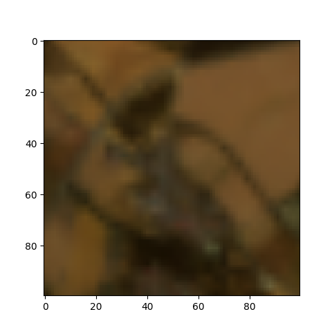
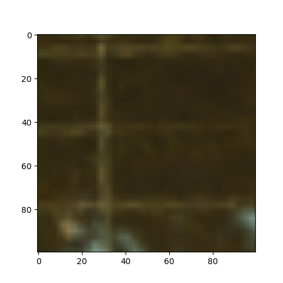
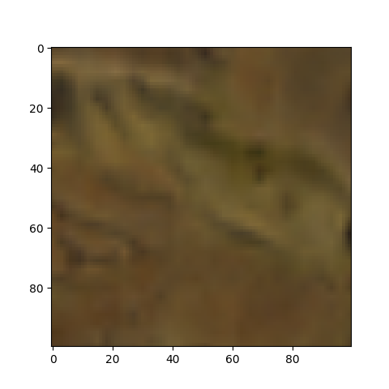
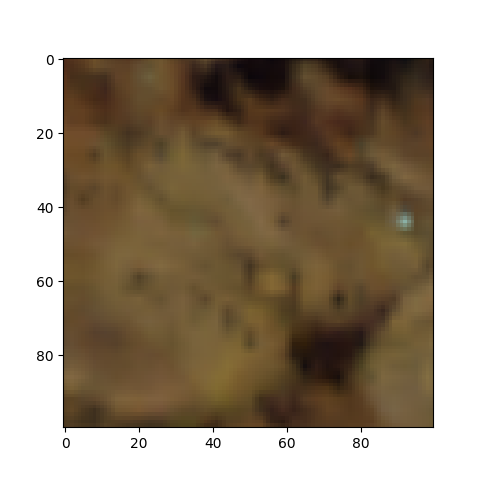
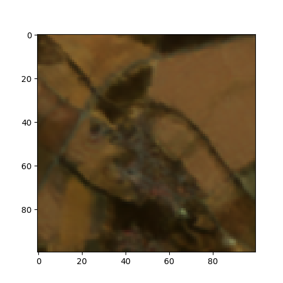
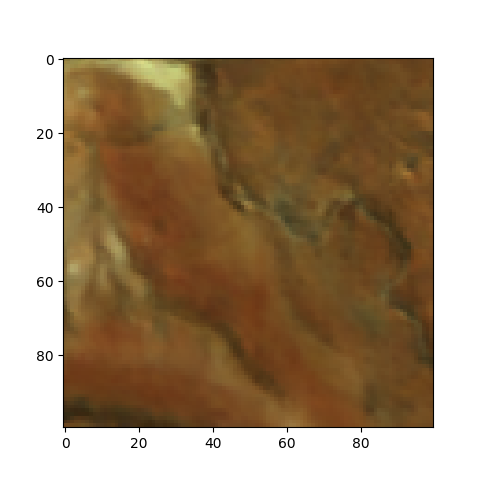
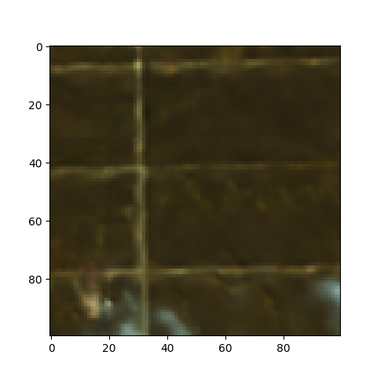
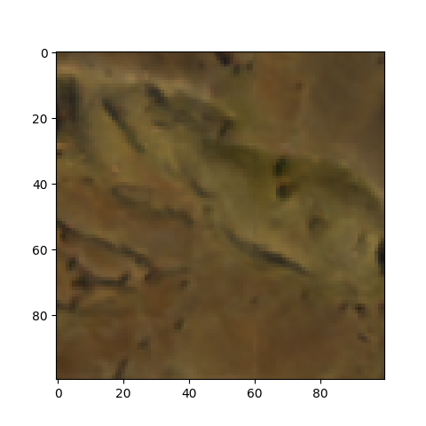
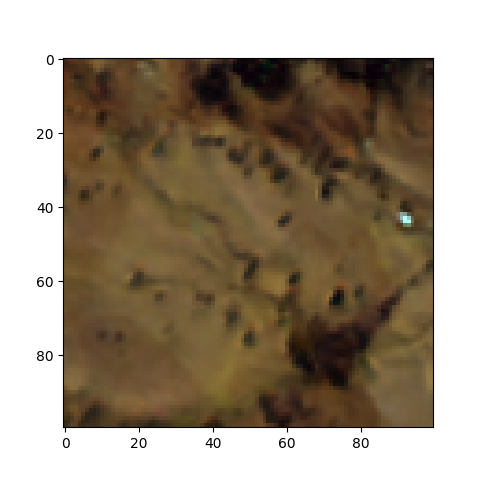

# EnMAP-sharpener-v0

Sharpening the spatial resolution of scenes from EnMAP satellite mission using a two-branch CNN with three-dimensional
convolution kernels and auxiliary scenes from Sentinel-2.
The trained model can be found in the [models directory](output/models/supErMAPnet.keras).

## Example Results

    

        
a)

        
b)

        
c)

        
d)

        
e)

    

    

        Bilinear interpolation
        
        
        
        
        
    

    

        supErMAPnet reconstruction
        
        
        
        
        
    

## Project Setup

### install dependencies:

``pip install -r requirements.txt``

### set the PYTHONPATH environment variable to include the project root:

``export PYTHONPATH=$(pwd)``

### create .env

Copy ``.env.example`` to ``.env`` and add values for ``COPERNICUS_CLIENT_ID`` and ``COPERNICUS_CLIENT_SECRET`` received
from your
Copernicus user account.
This is needed to fetch auxiliary Sentinel-2 data from the Sentinel Hub Process API.

## CLI tools

### download EnMAP data

EnMAP data can be downloaded from the DLR
geoservice (https://geoservice.dlr.de/eoc/ogc/stac/v1/collections/ENMAP_HSI_L2A) using ``start_enmap_scraping.py``.

Example: \
``python3 src/start_enmap_scraping.py --max-cloud-cover 10 --bbox 5.84 47.90 28.30 54.06 --date-time '2022-06-01T00:00:00Z/2022-09-31T23:59:59Z' --max-scenes 100 --enmap-dir /data/enmap/``

### preprocess data for model training

Example: \
``python3 src/start_preprocessing.py --stage crop``

possible stages: \
``all``: starts stages crop, scrape, check, mask, wald of PreprocessPipeline sequentially \
``crop``: crops EnMAP scenes and cloud masks to an axis parallel rectangle of the data coverage \
``scrape``: downloads Sentinel-2 scenes for the EnMAP scenes \
``check``: checks if the scene directories are harmonized \
``mask``: combines EnMAP and Sentinel-2 cloud masks and applies them to both rasters \
``clean``: removes all files that are not needed for training \
``wald``: applies the Wald protocol to the masked scenes to create model input data used in model training \
``predictions``: creates prediction ready data for the model

### train a model

Example: \
``python3 src/start_training.py --train-data-dir /data/preprocessing/model_input/ --gpus 1 2 --mem-limit 44 --batch-size 64 --epochs 10``

### sharpen EnMAP data

Example: \
``python3 src/start_sharpening.py --model /output/models/supErMAPnet.keras --input-dir /data/preprocessing/prediction_input/ --output-dir /output/predictions/``

### reconstruct EnMAP scenes from sharpened data tiles

Example: \
``python3 src/start_reconstruction.py --predictions-dir --meta-path /data/preprocessing/prediction_input/ --output-dir /output/predictions/reconstructions/``

### arguments for CPU cluster usage

``--cpus 1 2 3 4 --mem-limit 40``

### arguments for GPU cluster usage

``--gpus 0 1 --mem-limit 40``