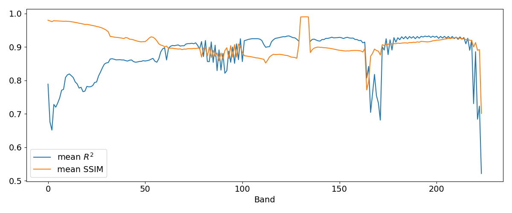
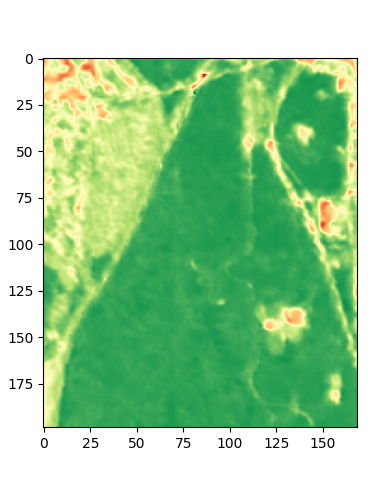
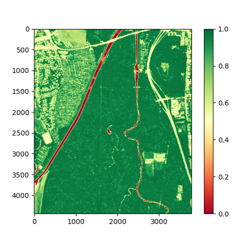

# EnMAP-sharpener-v0

Sharpening the spatial resolution of hyperspectral scenes from the EnMAP satellite mission using a two-branch CNN with
three-dimensional convolution kernels and auxiliary scenes from Sentinel-2.
The trained model can be found in the [models directory](output/models/supErMAPnet.keras).
This repository was created alongside my [master's thesis](Master_Thesis.pdf) in Computer Science at the University of
Leipzig, Germany.

## Example Results

In the following table, you can see excerpts of five different scenes recorded by the EnMAP satellite and upscaled from
the original resolution of 30 m × 30 m per Pixel to a resolution of 10 m × 10 m per Pixel. In the second column, you can
see
the results of a simple bilinear interpolation, while in the third column, you can see the resulting scenes that were
additionally sharpened using the trained SupErMAPnet model. \
For visualization purposes, three bands with center wavelengths of ~435 nm , ~545 nm, and ~700 nm were selected, scaled,
and high reflectance values discarded to increase brightness and simulate an RGB image.

| Scene | Bilinear Interpolation                                                                    | supErMAPnet Reconstruction                                                               |
|-------|-------------------------------------------------------------------------------------------|------------------------------------------------------------------------------------------|
| a)    |          |          |
| b)    |          |          |
| c)    |                |                |
| d)    |  |  |
| e)    |  |  |

## Evaluation results

Using Wald’s evaluation strategy and a dataset containing four scenes, supErMAPnet was evaluated based on various
metrics and compared with bilinear and bicubic interpolation, as well as with a sharpening strategy that uses bilinear
interpolation and unsharp masking:

| Method        | MSE      | PSNR      | SSIM     | SAM      | 
|---------------|----------|-----------|----------|----------|
| Bilinear      | 3251     | 29.20     | 0.86     | 8.00     |
| Cubic         | 3255     | 29.64     | 0.87     | 7.61     |
| Bilinear + UM | 3271     | 29.68     | 0.88     | 7.59     |
| supErMAPnet   | **3238** | **30.73** | **0.92** | **6.86** |

To investigate possible discrepancies in the sharpening quality of supErMAPnet over different spectral bands, the
coefficient of determination $R^2$ and the SSIM values between the sharpened scenes and their originals were calculated
for each band and averaged over the four evaluation scenes:

To better evaluate the sharpening of EnMAP images to the same spatial resolution as Sentinel-2 data with the proposed
model, co-registered high spatial resolution hyperspectral data must be available. For this purpose, a hyperspectral
airborne scene, acquired by the Helmholtz Centre for Environmental Research (UFZ) on June 12, 2023, was used. This scene
has a spatial resolution of ~0.45 m × ~0.45 m per pixel, a spectral resolution of 455 bands and covers a southern part
of the Leipziger Auwald, a riparian forest near Leipzig, as well as some urban parts of the city.
The following figure shows the normalized difference vegetation index (NDVI) for the cropped scene recorded by
the UFZ in comparison to the same area captured by EnMAP, once bilinear interpolated and once sharpened with supErMAPnet
to a resolution of 10 m × 10 m.

| Bilinear Interpolation                                                                                    | supErMAPnet Reconstruction                                                                                 | UFZ Hyperspectral Scene                                                                       |
|-----------------------------------------------------------------------------------------------------------|------------------------------------------------------------------------------------------------------------|-----------------------------------------------------------------------------------------------|
|  |  |  |

## Project Setup

### install dependencies:

``pip install -r requirements.txt``

### set the PYTHONPATH environment variable to include the project root:

``export PYTHONPATH=$(pwd)``

### create .env

Copy ``.env.example`` to ``.env`` and add values for ``COPERNICUS_CLIENT_ID`` and ``COPERNICUS_CLIENT_SECRET`` received
from your
Copernicus user account.
This is needed to fetch auxiliary Sentinel-2 data from the Sentinel Hub Process API.

## CLI tools

### download EnMAP data

EnMAP data can be downloaded from the DLR
geoservice (https://geoservice.dlr.de/eoc/ogc/stac/v1/collections/ENMAP_HSI_L2A) using ``start_enmap_scraping.py``.

Example: \
``python3 src/start_enmap_scraping.py --max-cloud-cover 10 --bbox 5.84 47.90 28.30 54.06 --date-time '2022-06-01T00:00:00Z/2022-09-31T23:59:59Z' --max-scenes 100 --enmap-dir /data/enmap/``

### preprocess data for model training

Example: \
``python3 src/start_preprocessing.py --stage crop``

possible stages: \
``all``: starts stages crop, scrape, check, mask, wald of PreprocessPipeline sequentially \
``crop``: crops EnMAP scenes and cloud masks to an axis parallel rectangle of the data coverage \
``scrape``: downloads Sentinel-2 scenes for the EnMAP scenes \
``check``: checks if the scene directories are harmonized \
``mask``: combines EnMAP and Sentinel-2 cloud masks and applies them to both rasters \
``clean``: removes all files that are not needed for training \
``wald``: applies the Wald protocol to the masked scenes to create model input data used in model training \
``predictions``: creates prediction ready data for the model

### train a model

Example: \
``python3 src/start_training.py --train-data-dir /data/preprocessing/model_input/ --gpus 1 2 --mem-limit 44 --batch-size 64 --epochs 10``

### sharpen EnMAP data

Example: \
``python3 src/start_sharpening.py --model /output/models/supErMAPnet.keras --input-dir /data/preprocessing/prediction_input/ --output-dir /output/predictions/``

### reconstruct EnMAP scenes from sharpened data tiles

Example: \
``python3 src/start_reconstruction.py --predictions-dir --meta-path /data/preprocessing/prediction_input/ --output-dir /output/predictions/reconstructions/``

### arguments for CPU cluster usage

``--cpus 1 2 3 4 --mem-limit 40``

### arguments for GPU cluster usage

``--gpus 0 1 --mem-limit 40``